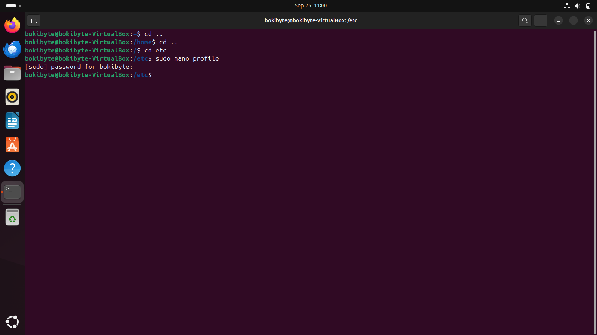
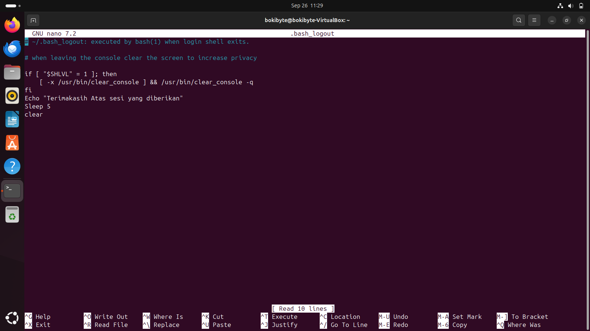
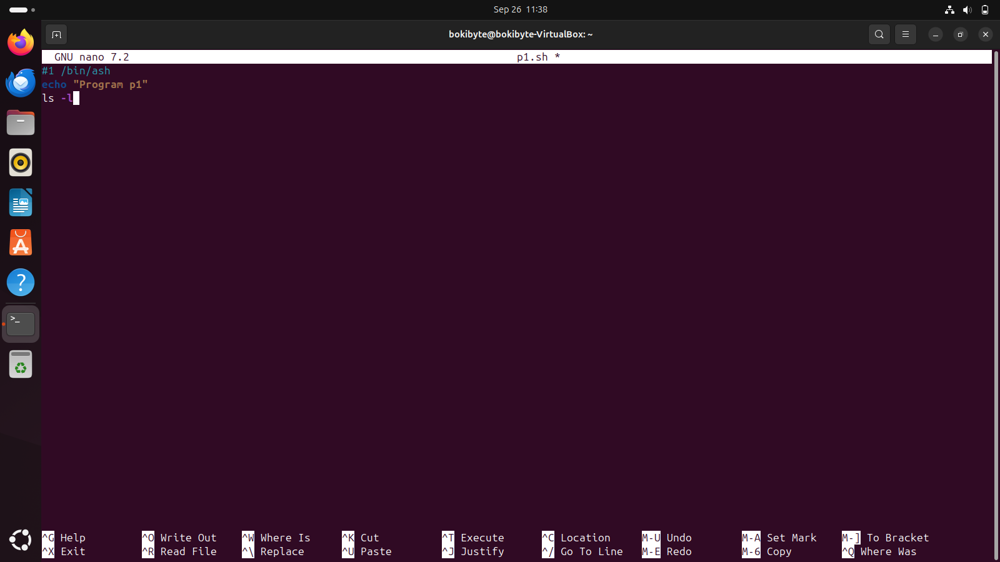
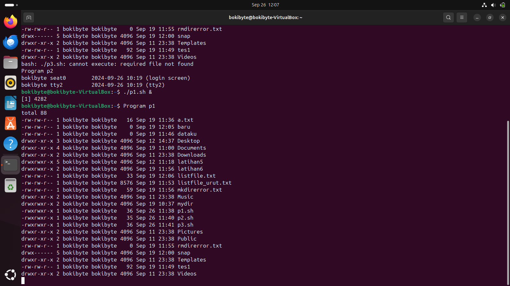
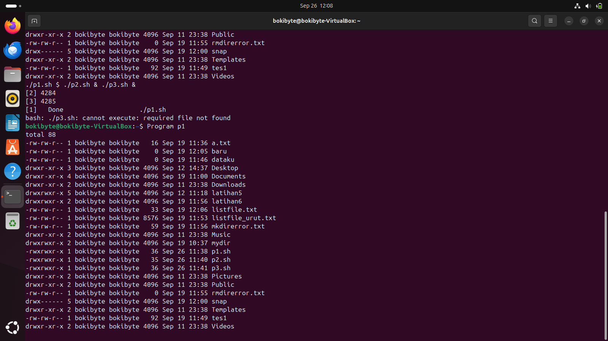
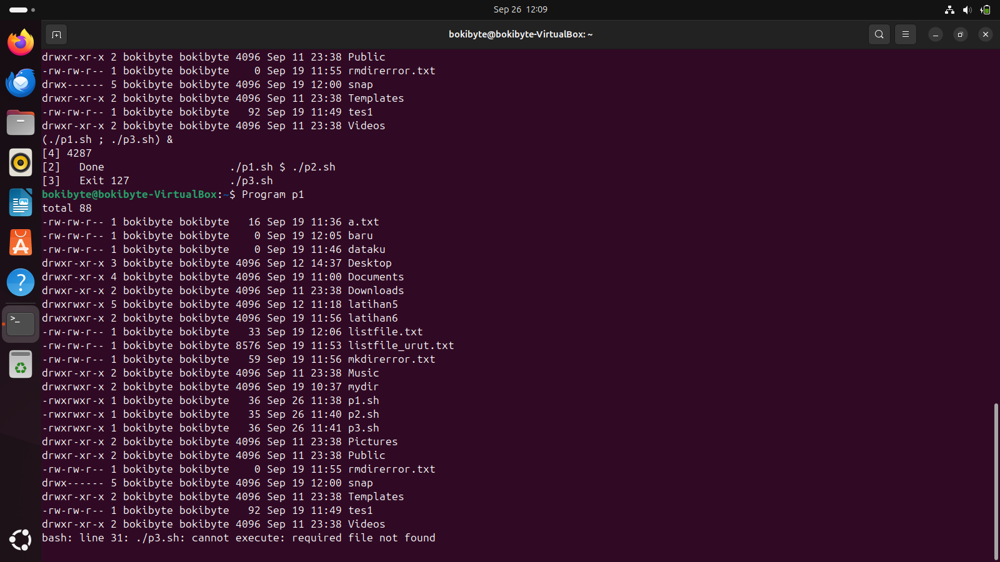
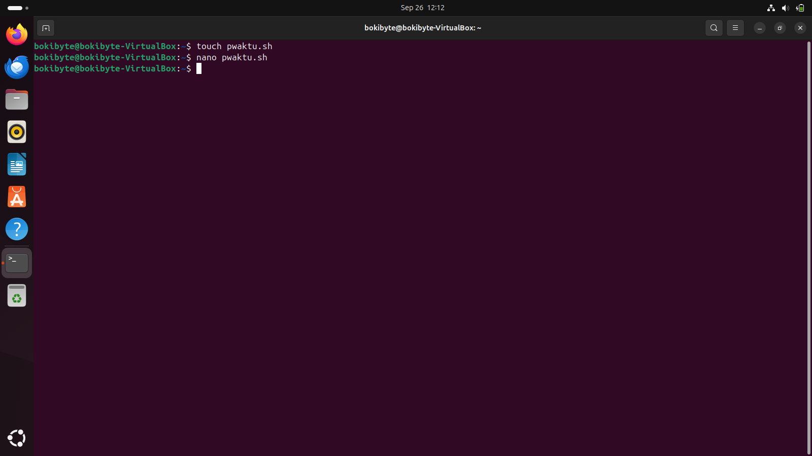
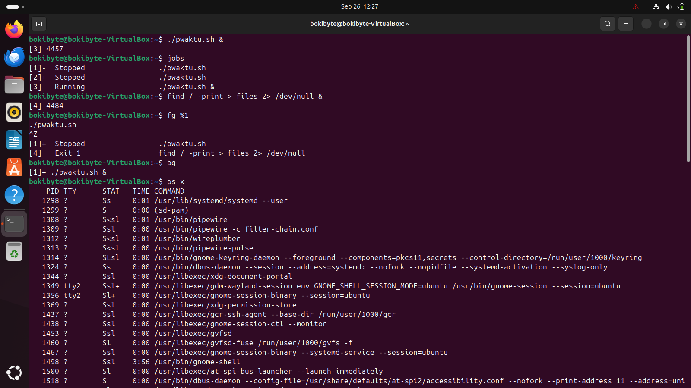
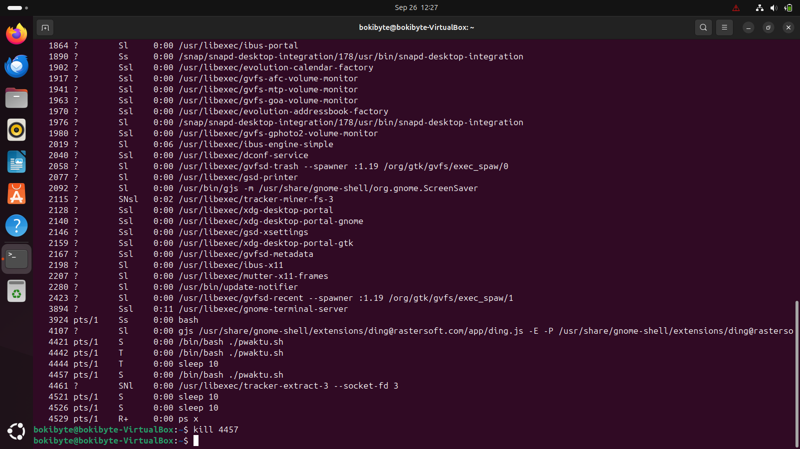

# Praktikum 5
---
## Soal + Jawab

1. Eksekusi seluruh profile yang ada :
    a. Edit file profile `/etc/profile` dan tampilkan pesan sebagai berikut :
    ```
    echo “Profile dari /etc/profile”
    ```

    
    

    b. Asumsi nama anda `stD02001`, maka edit semua profile yang ada yaitu :
    ```
    /home/stD02001/.bash_profile
    /home/. stD02001/.bash_login
    /home/mahasiswa/.profile
    /home/mahasiswa/.bashrc
    ```

    
    
    Ganti nama `/home/mahasiswa` dengan nama anda sendiri. Pada setiap file tersebut, cantumkan instruksi echo, misalnya pada `/home/ mahasiswa/.bash_profile` :
    `echo` “Profile dari `.bash_profile`”
    Lakukan hal yang sama untuk file lainnya, sesuaikan tampilan dengan nama file yang bersangkutan.
    c. Jalankan instruksi subtitute user, kemudian keluar dengan perintah exit sebagai berikut:\
    ```
    $ su mahasiswa
    $ exit
    ```
    kemudian gunakan opsi – sebagai berikut :
    ```
    $ su – mahasiswa
    $ exit
    ```
    

    Jelaskan perbedaan kedua utilitas tersebut.  

    `su`: Hanya mengganti user, tetapi tetap menggunakan environment dan direktori dari user sebelumnya.
    `su -`: Mengganti user dan menginisialisasi environment serta direktori home dari user yang baru.

2. Prompt String (PS)
    a. Edit file .bash_profile, ganti prompt PS1 dengan ‘>’. Instruksi export diperlukan dengan parameter nama variable tersebut, agar perubahan variable PS1 dikenal oleh semua shell
    ```
    PS1=“ > “
    export PS1
    ```
    b. Eksperimen hasil PS1 :
    ```
    $ PS1=“\! > “
    69 > PS1=”\d > “
    Mon Sep 23 > PS1=”\t > “
    10:10:20 > PS1=”Saya=\u > “
    Saya=mahasiswa > PS1=”\w >”
    ~ > PS1=\h >”
    ```
3. Logout
    Edit file .bash_logout, tampilkan pesan dan tahan selama 5 detik, sebelum eksekusi logout
    ```
    Echo “Terima kasih atas sesi yang diberikan”
    Sleep 5
    clear
    ```

    
    

4. Bash script
    a. Buat 3 buah script `p1.sh`, `p2.sh`, `p3.sh` dengan isi masing-masing :
    ```
    p1.sh
    #! /bin/bash
    echo “Program p1”
    ls –l
    p2.sh
    #! /bin/bash
    echo “Program p2”
    who
    p3.sh
    #! /bin/bash
    echo “Program p3”
    ps x
    ```

    
    
    
    

    b. Jalankan script tersebut sebagai berikut :
    ```
    $ ./p1.sh ; ./p3.sh ; ./p2.sh
    $ ./p1.sh &
    $ ./p1.sh $ ./p2.sh & ./p3.sh &
    $ ( ./p1.sh ; ./p3.sh ) &
    ```

    
    
    
    
5. Jobs
    a. Buat shell-script yang melakukan loop dengan nama pwaktu.sh, setiap 10 detik, kemudian menyimpan tanggal dan jam pada file hasil.
    ```
    #!/bin/bash
    while [ true ]
        do
        date >> hasil
        sleep 10
    done
    ```

    
    

    b. Jalankan sebagai background; kemudian jalankan satu program (utilitas find) di background sebagai berikut :
    ```
    $ jobs
    $ find / -print > files 2>/dev/null &
    $ jobs
    ```
    c. Jadikan program ke 1 sebagai foreground, tekan ^Z dan kembalikan program tersebut ke background
    ```
    $ fg %1
    $ bg
    ```

      

    d. Stop program background dengan utilitas kil
    ```
    $ ps x
    $ kill [Nomor PID]
    ```

      

    1. History
    a. Ganti nilai HISTSIZE dari 1000 menjadi 20
    ```
    $ HISTSIZE=20
    $ h
    ```
    b. Gunakan fasilitas history dengan mengedit instruksi baris ke 5 dari instruksi yang terakhir dilakukan
    ```
    $ !-5
    ```
    c. Ulangi instruksi yang terakhir. Gunakan juga ^P dan ^N untuk bernavigasi pada history bufer
    ```
    $ !!
    ```
    d. Ulangi instruksi pada history bufer nomor 150
    ```
    $ !150
    e. Ulangi instruksi dengan prefix “ls”
    $ !ls
    ```

    