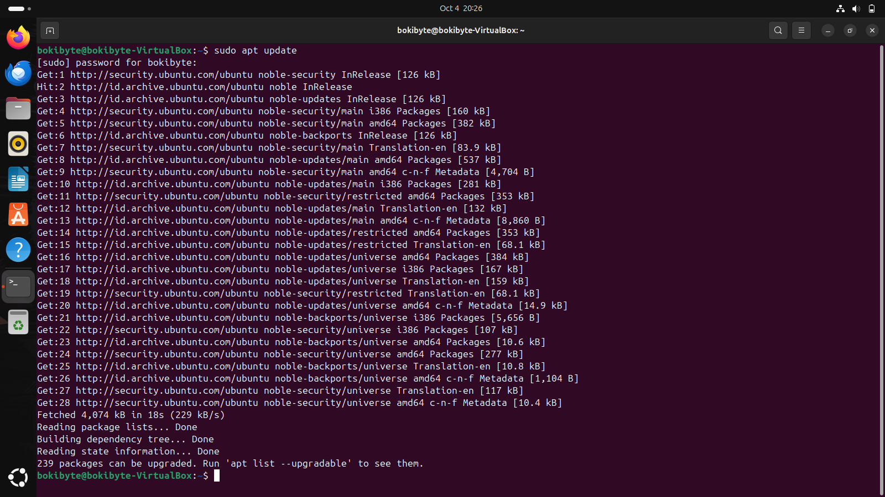
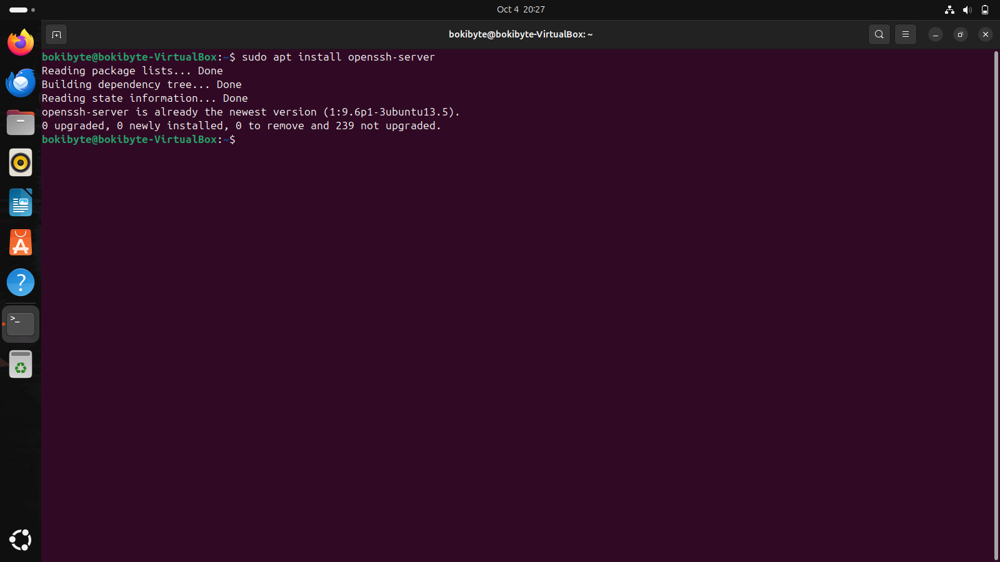
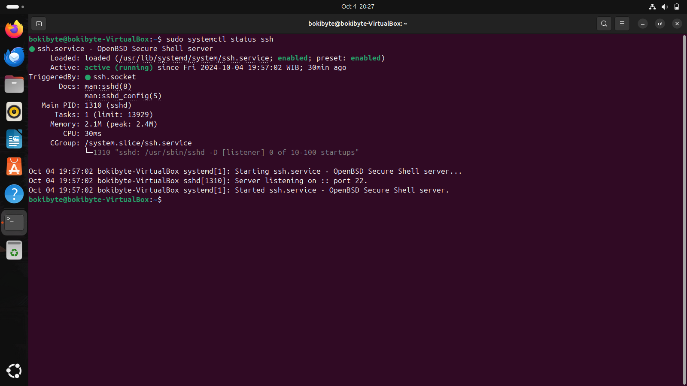
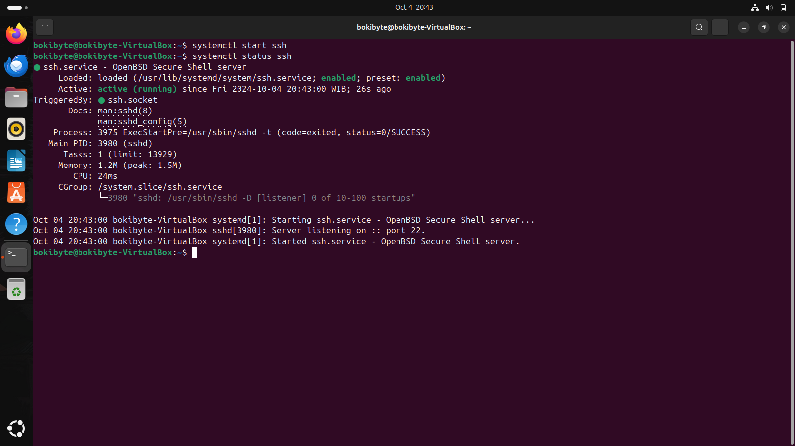
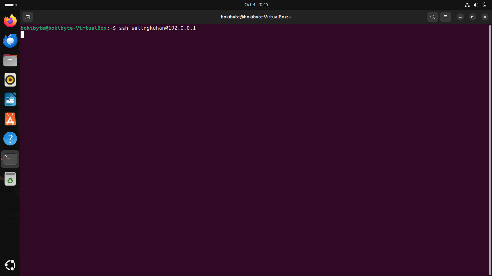
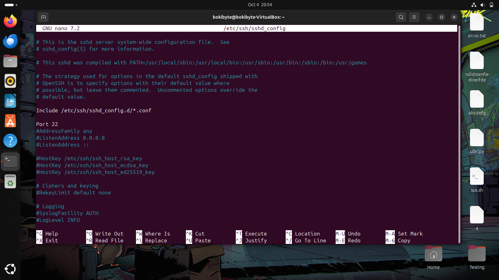

# Konfigurasi dan Menggunakan SSH

---

### Installasi

1. Update dulu `apt` nya menggunakan `apt update` :

    

2. Install OpenSSH Server
   
    

> itu jika sudah diinstall sebelumnya

### Penggunaan

1. Cek dulu SSH apakah sudah berjalan dengan `sudo systemctl status ssh` :

    

2. Jika belum mulai, bisa start dengan `sudo systemctl start ssh` : 
   
   

3. Hubungkan ssh dengan `ssh namauser@alamatIP`. contoh:
   
   

>[!NOTE]
>Untuk cek ip, gunakan:
>1. Private IP :
>   `ip a`
>2. Public IP : 
>   `curl ifconfig.me`


beberapa command yang mungkin berguna:
1. menghentikan ssh 
    ```
    sudo systemctl stop ssh
    ```
2. restart ssh
   ```
   sudo systemctl restart ssh
   ```
3. mengaktifkan ssh agar berjalan saat boot
   ```
   sudo systemctl enable ssh
   ```
4. menonaktifkan ssh agar tidak berjalan saat boot
   ```
   sudo systemctl disable ssh
   ```

### Troubleshooting

Biasanya terkendala seperti refused, tidak bisa terhubung, atau sebagainya bisa diakali dengan cara berikut. sebelumnya pastikan device lain dalam satu jaringan.

1. Jika problem pada Port, edit  port ssh pada:
   ```
   /etc/ssh/sshd_config
   ```
   lalu hapus `#` sesuai pengaturan yang ingin diaktifkan dan ubah konfigurasinya (contoh port nya diubah ke 22) : 

    

    Setelah itu lalu restart SSH.

2. Jika problemnya Firewall, cek dahulu apakah firewall aktif dengan 
   ```
   sudo ufw status
   ```
   jika on, bisa saja dimatikan (opsional) dengan:
   ```
    ufw disable
   ```
    untuk mengizinkan secara khusus (misalnya port 22):
    ```
    ufw allow 22/tcp
    ```
    command `ufw allow` memiliki fungsi lain seperti `ssh`,`https`, `from <ip>`, `from <ip> to any port <port>`.

Setelah problem selesai (semoga 😄), jangan lupa direstart SSH nya.