# 💻 Instalasi OS - Linux 

Halo, Saya akan membagikan cara instalasi Linux dengan list distro yang saya sediakan. disini juga ada tutorialnya. ini dibuat sebagai tugas dan juga untuk mempercantik github supaya tampak hijau wkwk.  

---

# 🔧 Step Menginstall Linux 

- [💻 Instalasi OS - Linux](#-instalasi-os---linux)
- [🔧 Step Menginstall Linux](#-step-menginstall-linux)
- [Software untuk Virtual Machine](#software-untuk-virtual-machine)
    - [Perbandingan VMware dan VirtualBox](#perbandingan-vmware-dan-virtualbox)
- [Pemilihan Distro](#pemilihan-distro)
    - [Ubuntu](#ubuntu)
    - [Kali](#kali)
    - [Arch](#arch)
    - [Debian](#debian)
    - [Rocky](#rocky)
    - [Mint](#mint)
    - [Tails](#tails)
    - [Fedora](#fedora)
- [Membuat VM - Edisi Ubuntu](#membuat-vm---edisi-ubuntu)
    - [Installasi Ubuntu](#installasi-ubuntu)
      - [Kenapa Harus " / " 🤔](#kenapa-harus----)
      - [Acuan dalam Memilih Tipe Format Disk](#acuan-dalam-memilih-tipe-format-disk)
      - [Hasil Instalasi](#hasil-instalasi)
- [Command Testing](#command-testing)
  - [Navigasi](#navigasi)
  - [Operasi pada File \& Folder](#operasi-pada-file--folder)
  - [Pengecekan dan Pengelolaan Sistem](#pengecekan-dan-pengelolaan-sistem)
  - [Operasi Manipulasi Teks](#operasi-manipulasi-teks)
  - [Pengelolaan Adminstrator dan Izin](#pengelolaan-adminstrator-dan-izin)
  - [Jaringan](#jaringan)
  - [Menginstall Beberapa Tools](#menginstall-beberapa-tools)

---

# Software untuk Virtual Machine

Kebanyakan orang memilih antara menggunakan vm atau dualboot. tetapi, lebih praktis dengan vm. Berikut rekomendasi software vm:

- [Virtual Box](https://www.virtualbox.org/)
- [VMware Workstation](https://blogs.vmware.com/workstation/2024/05/vmware-workstation-pro-now-available-free-for-personal-use.html)

> [!WARNING]
> Pastikan device anda memiliki spesifikasi cukup kuat dan CPU harus mendukung teknologi virtualisasi seperti Intel VT-x atau AMD-V. Untuk user celeron, i know how its pain.

### Perbandingan VMware dan VirtualBox

| Aspek                  | VMware                                | VirtualBox (VBox)                     |
|------------------------|---------------------------------------|---------------------------------------|
| **Performa**           | Umumnya lebih baik dalam hal kinerja, terutama dalam aplikasi berat atau server. | Baik untuk penggunaan umum, tapi performa bisa lebih rendah dibanding VMware pada beban berat. |
| **Kompatibilitas**     | Mendukung berbagai sistem operasi tamu, termasuk integrasi yang baik dengan Windows dan Linux. | Juga mendukung banyak OS tamu, tapi terkadang ada masalah kompatibilitas pada OS tertentu. |
| **User Interface**     | Antarmuka pengguna yang lebih polished dan profesional, terutama pada versi berbayar (Workstation Pro). | Antarmuka sederhana dan fungsional, cukup mudah digunakan untuk pengguna umum. |
| **Fitur**              | Fitur canggih seperti snapshot, cloning, dan integrasi dengan perangkat keras lebih baik pada versi berbayar. | Menyediakan banyak fitur dasar dan beberapa fitur canggih, tetapi dengan kemampuan yang lebih terbatas. |
| **Lisensi**            | VMware Workstation Player tersedia gratis untuk penggunaan pribadi; Workstation Pro berbayar. | Gratis dan open-source, mendukung pengguna pribadi dan komersial tanpa biaya tambahan. |
| **Virtualization**     | Mendukung virtualisasi hardware langsung (VT-x/AMD-V), dengan optimasi yang baik di versi berbayar. | Juga mendukung VT-x/AMD-V, tetapi optimasi bisa kurang efisien dibanding VMware. |
| **Dukungan Komunitas** | Komunitas besar, terutama untuk produk berbayar, dengan banyak dokumentasi dan dukungan resmi. | Komunitas yang sangat besar dan aktif, banyak forum dan dokumentasi tersedia. |
| **Pembaruan**          | Pembaruan reguler, terutama untuk versi berbayar dengan peningkatan performa dan fitur. | Pembaruan reguler, tetapi tidak secepat atau seintensif VMware. |
| **Integrasi Host**     | Integrasi yang baik dengan host OS, terutama pada versi Workstation Pro. | Integrasi yang baik dengan host, tetapi tidak sehalus VMware dalam beberapa kasus. |
| **Biaya**              | Versi berbayar memiliki biaya lisensi yang cukup tinggi, meskipun ada versi gratis dengan fitur terbatas. | Gratis, tanpa biaya lisensi, bahkan untuk penggunaan komersial. |

Selanjutnya, kita akan menggunakan VirtualBox sebagai vm.

# Pemilihan Distro

Distro[^1] linux ada banyak, bisa dipilih sesuai kebutuhan. berikut beberapa listnya:

### [Ubuntu](https://ubuntu.com/download/desktop)

- **Bagusnya**: Ramah pengguna, stabil, dukungan komunitas besar, banyak digunakan oleh pemula dan profesional. Cocok untuk penggunaan sehari-hari, pengembangan perangkat lunak, dan server.
- **Untuk**: Desktop, Server, Cloud.

### [Kali](https://www.kali.org/get-kali/)

- **Bagusnya**: Dirancang khusus untuk keamanan siber dan pengujian penetrasi (pentest). Dilengkapi dengan berbagai alat pentest yang sudah terinstall.
- **Untuk**: Pentesting, Forensik digital, Keamanan siber.

### [Arch](https://archlinux.org/download/)

- **Bagusnya**: Sangat ringan dan cepat, memberikan pengguna kontrol penuh untuk mengatur sistem sesuai kebutuhan. Sangat dihargai oleh pengguna tingkat lanjut karena kesederhanaannya.
- **Untuk**: Pengguna tingkat lanjut, pengguna yang ingin kustomisasi penuh.

### [Debian](https://www.debian.org/distrib/)

- **Bagusnya**:  Stabilitas tinggi, banyak digunakan di server karena kestabilannya. Basis dari banyak distro lain, termasuk Ubuntu.
- **Untuk**: Server, Desktop, Penggunaan umum.

### [Rocky](https://rockylinux.org/download)

>[!CAUTION]
>Ini tidak dibuat oleh Rocky Gerung!

- **Bagusnya**: Stabil dan reliabel, banyak digunakan di lingkungan server enterprise karena berbasis pada Red Hat Enterprise Linux (RHEL).
- **Untuk**: Server, Enterprise.

### [Mint](https://www.linuxmint.com/download.php)

- **Bagusnya**: Antarmuka pengguna yang familiar bagi pengguna Windows, stabil, ramah pengguna, dan ringan. Cocok untuk mereka yang beralih dari Windows.
- **Untuk**: Pengguna desktop umum, Pemula.

### [Tails](https://tails.net/install/download/index.en.html?ref=decredmagazine.com)

- **Bagusnya**: Didesain untuk keamanan dan privasi, dapat dijalankan dari USB tanpa meninggalkan jejak di komputer host.
- **Untuk**: Keamanan, Privasi, Aktivitas sensitif.

### [Fedora](https://fedoraproject.org/id/)

- **Bagusnya**:  Distro cutting-edge yang sering menjadi ujung tombak teknologi baru di dunia Linux. Mendapatkan pembaruan yang sangat cepat.
- **Untuk**:  Developer, pengujian fitur terbaru.

---

# Membuat VM - Edisi Ubuntu

Kita akan memakai VirtualBox sebagai vm dan ubuntu sebagai distro. berikut step-by-stepnya:

1. Pertama kita set nama dan lain lain untuk memberi identitas pada vm yang akan kita buat serta memilih disc OS yang akan diinstal.

    

> [!NOTE]
> - Pilih skip unattended installation untukmeminimalkan birokrasi yng ribet!

2. Lalu kita sesuaikan dengan hardware yang kita miliki. semakin besar semakin baik, tetapi semua kembali ke hardware yang dimiliki dan tujuan dari vm yang dibuat.
   
   
   
3. Alokasikan disk untuk digunakan sebagai virtual harddisk.   
   
     

> [!CAUTION]
> Menyetel terlalu rendah dapat membuat vm bermasalahbahkan stuck! gunakan hanya dengan batas minimum 20GB.  

> [!NOTE]
> - centang Pre-allocated untuk membuat disk kosongterlebih dahulu sebagai alokasi ruang atau istilahnya"memesan ruang"
> - jika sudah ada virtual disk pilih use an exiting.

4. Rincian akir jika sudah selesai tekan finish. jika belum bisa kembali atau diatur disetting.

   

5. Setelah selesai jangan lupa di start!

    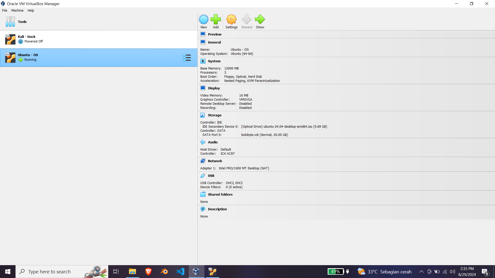

---

### Installasi Ubuntu

<p align="center">
    <br>
</p>

1. Pilih keyboard layout sesuai yang dimiliki. (umumnya querty, yaitu english).

    

2. Hubungkan ke internet (disarankan).

    

3. Pilih `Install Ubuntu` .

    

4. Pilih interactive install. atau jika sudah memiliki `autoinstall.yaml` bisa pilih `Automated Installation`.

    

5. piih sesuai kebutuhan.

    

> [!NOTE]
> - Default hanya utilitas dan basic ubuntu.
> - Extended bagi yang ingin utilitas lebih atau yang ingin menjadikan ubuntu sebagai main OS.

6. Pilih sesuai kebutuhan.

    

7. Pilih manual (disarankan).

    

8. buat partisi untuk sistem dengan mount point `/` lalu partisi lagi dengan mount point bebas. setelah itu next.

    

#### Kenapa Harus " / " 🤔

ya singkatnya itu awal dari direktori linux. Selama instalasi Ubuntu, memilih "/" sebagai Mount Point sangat penting karena "/" (disebut root) adalah direktori utama dari sistem file Linux. Semua file sistem operasi diorganisir di bawah "/". Tanpa menentukan "/" sebagai Mount Point, sistem tidak akan tahu di mana menempatkan file-file inti yang diperlukan untuk berfungsi dengan benar. Ini memastikan bahwa sistem operasi memiliki struktur yang tepat dan dapat berjalan dengan baik.

#### Acuan dalam Memilih Tipe Format Disk 
    
| Sistem Berkas | Keuntungan | Kekurangan |
|---------------|------------|------------|
| **EXT4**[^2]    | - Kinerja lebih baik dibandingkan EXT3 <br> - Mendukung ukuran file dan sistem berkas yang lebih besar <br> - Dapat memulihkan data dengan lebih baik <br> - Dukungan journaling untuk mengurangi risiko kehilangan data | - Tidak sepenuhnya kompatibel dengan Windows <br> - Fitur canggihnya mungkin berlebihan untuk penggunaan ringan |
| **EXT3**[^3]   | - Stabil dan telah teruji selama bertahun-tahun <br> - Dukungan journaling <br> - Kompatibel dengan sebagian besar distribusi Linux | - Kinerja lebih rendah dibandingkan EXT4 <br> - Dukungan ukuran file dan sistem berkas lebih kecil dibandingkan EXT4 <br> - Tidak mendukung fitur canggih seperti EXT4 |
| **SWAP**[^4]      | - Digunakan untuk memperluas kapasitas RAM virtual <br> - Membantu dalam manajemen memori ketika RAM terbatas | - Hanya digunakan untuk memori virtual, bukan penyimpanan data <br> - Kinerja mungkin lebih rendah dibandingkan dengan RAM fisik <br> - Data tidak disimpan secara permanen |
| **NTFS**[^5]      | - Dukungan fitur canggih seperti kompresi, enkripsi, dan kontrol akses <br> - Kompatibel dengan Windows dan dapat dibaca/tulis oleh Linux dengan driver tambahan <br> - Dukungan ukuran file dan sistem berkas yang besar | - Kinerja mungkin lebih rendah pada sistem non-Windows <br> - Dukungan penuh di Linux membutuhkan instalasi driver tambahan <br> - Kompleksitas yang lebih tinggi dibandingkan sistem berkas Linux |
| **FAT32**[^6]     | - Kompatibilitas luas dengan berbagai sistem operasi (Windows, Linux, macOS) <br> - Sederhana dan mudah digunakan | - Mendukung ukuran file maksimum 4GB <br> - Dukungan ukuran partisi maksimum 2TB <br> - Tidak ada fitur journaling <br> - Kurangnya keamanan dan kontrol akses |
| **BTRFS**[^7]     | - Mendukung snapshot dan pengembalian (rollback) <br> - Manajemen volume dan RAID built-in <br> - Dukungan untuk cek konsistensi data dan pemulihan <br> - Skalabilitas dan kinerja tinggi | - Masih dianggap lebih eksperimental dibandingkan EXT4 <br> - Kompleksitas pengaturan dan manajemen <br> - Beberapa fitur mungkin tidak stabil atau belum matang |

    
> [!NOTE]
> - Kalo di windows, ini seperti `C:\` dan `D:\`
> - Jika ruang kosong banyak, bisa dibuat partisi lain juga dengan mount point berbeda.

> [!TIP]
> - EXT4 itu kayak jalan raya yang dibangun dengan teknologi terbaru. Mobil bisa jalan lebih cepat, lebih banyak mobil bisa lewat, dan jalanan lebih jarang rusak. Jadi, komputer Linux yang pakai EXT4 biasanya lebih stabil dan cepat.
> - EXT3 itu seperti jalan raya yang lebih tua tapi masih kokoh dan aman. Mungkin nggak secepat EXT4, tapi kalau tiba-tiba ada kecelakaan, jalan ini punya rambu-rambu yang mencegah kerusakan lebih parah.
> - Bayangkan SWAP itu seperti gudang cadangan di rumah. Kalau rumah (RAM) penuh dengan barang, beberapa barang bisa dipindahkan ke gudang (SWAP) supaya rumah nggak jadi sesak dan tetap nyaman.
> - NTFS itu seperti apartemen modern di kota besar. Punya sistem keamanan canggih, bisa menampung barang banyak (file besar), dan kalau ada masalah, biasanya bisa diperbaiki sendiri tanpa harus dipanggil teknisi.
> - FAT32 itu kayak tas ransel kecil yang ringan dan simpel, cocok buat bawa barang ke mana-mana (data), tapi nggak bisa bawa barang yang terlalu besar. Jadi, kalau mau simpan file video berukuran besar, tas ini nggak muat.
> - BTRFS itu seperti lemari penyimpanan high-tech dengan banyak laci dan fitur-fitur otomatis. Misalnya, bisa bikin salinan isi lemari secara instan (snapshot) atau ngecilin ukuran barang yang disimpan (kompresi), sehingga barang lebih banyak muat di dalamnya.

1. Buat akun untuk OS Ubuntu.

    

> [!CAUTION]
> - JANGAN LUPA YA DATA DIRINYA WKWKWK

> [!NOTE]
> - Jangan centang `require my password to login` kalo gapengen ribet login lagi.

10. ini tampilan dari pilihan penginstallan sebelumnya. jika dirasa ada yang kurang bisa kembali.

    

11. Kesabaran diuji. silakan tinggal dan bermain game atau aktivitas lainnya.

    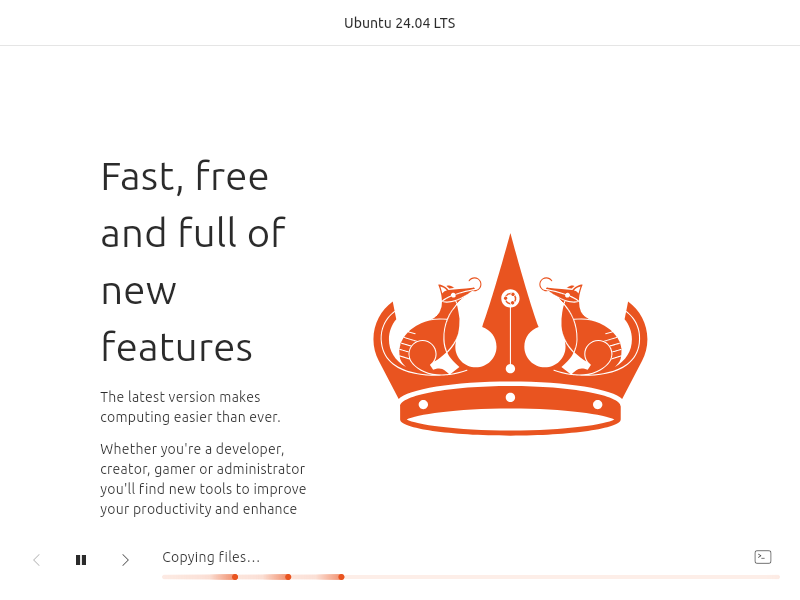

> [!TIP]
> gas login daily.

12. Tada! Ubuntu berhasil diinstall!

#### Hasil Instalasi

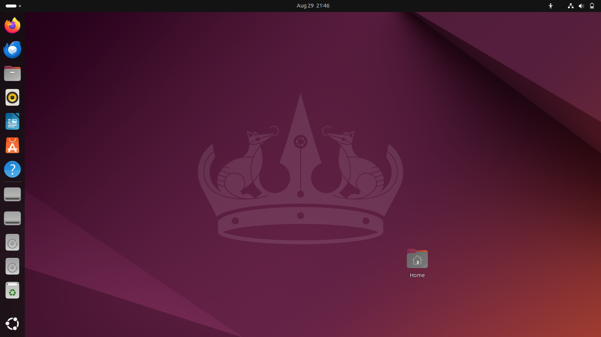

> [!TIP]
> Layar bisa di ubah melalui klik kanan > Display Setting > Display > Resolution

---

# Command Testing

## Navigasi

- cek direktori
    ```
    pwd
    ```
- melihat isi direktori berada
    ```
    ls
    ```
- melihat isi direktori berada dengan list
    ```
    ls -l
    ```
- menampilkan file folder tersembunyi
    ```
    ls -a
    ```
- masuk kedalam direktori
    ```
    cd (nama dir atau path)
    ```

> [!TIP]
> Contoh `cd \home\desktop\` , `cd ~\desktop\20gbTrojan\` , dan `cd ArsipSupersemar`

- kembali ke direktori sebelumnya
    ```
    cd ..
    ```

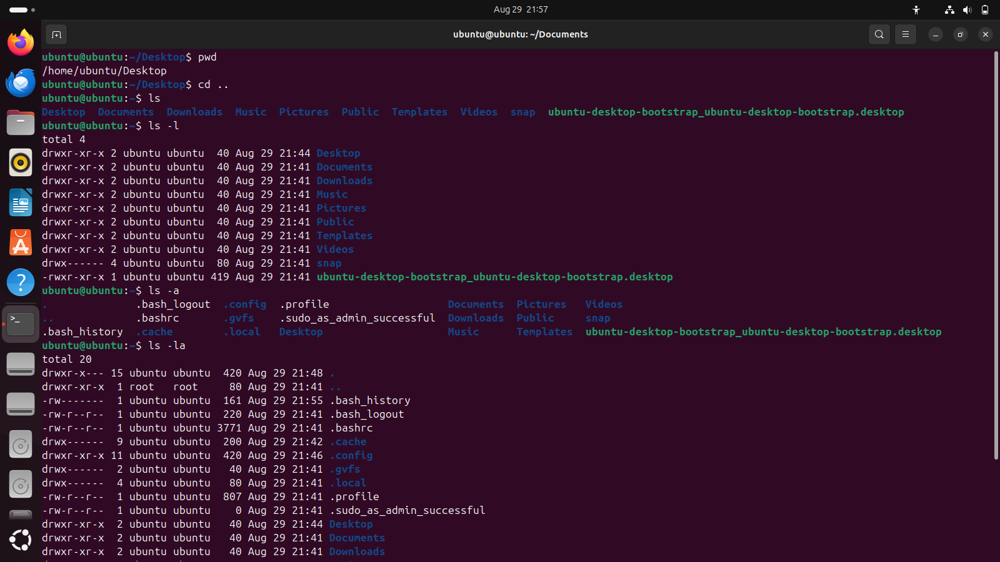

---

## Operasi pada File & Folder

- membuat folder
    ```
    mkdir (tujuan)
    ```
- membuat file
    ```
    touch (tujuan)
    ```
- menghapus file
    ```
    rm (tujuan)
    ```
- menghapus folder
    ```
    rm -r (tujuan)
    ```
- salin
    ```
    cp (nama) (tujuan)
    ```
- memindahkan
    ```
    mv (nama) (tujuan)
    ```
- mengganti nama
    ```
    cp (nama) (namabaru)
    ```

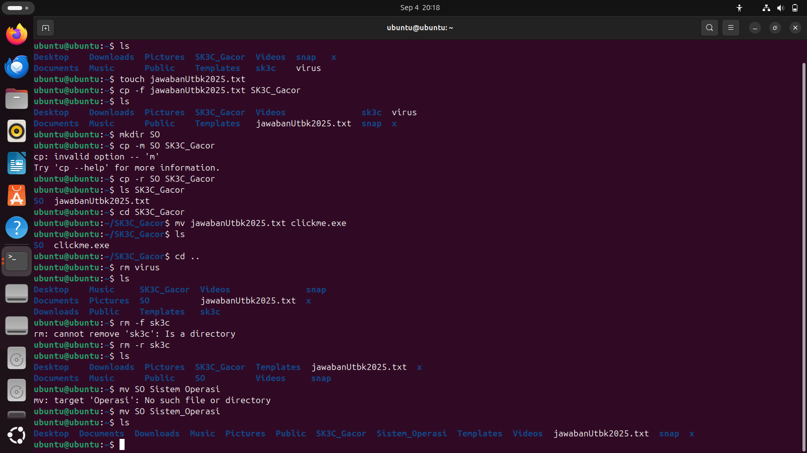

## Pengecekan dan Pengelolaan Sistem

- rincian penggunaan disk
  ```
  df -h
  ```
- mengecek informasi sistem
  ```
  uname -a
  ```
- upgrade semua paket
  ```
  sudo apt upgrade
  ```
- update daftar paket tersedia
  ```
  sudo apt update
  ```
- task manager ala ubuntu
  ```
  top
  ```

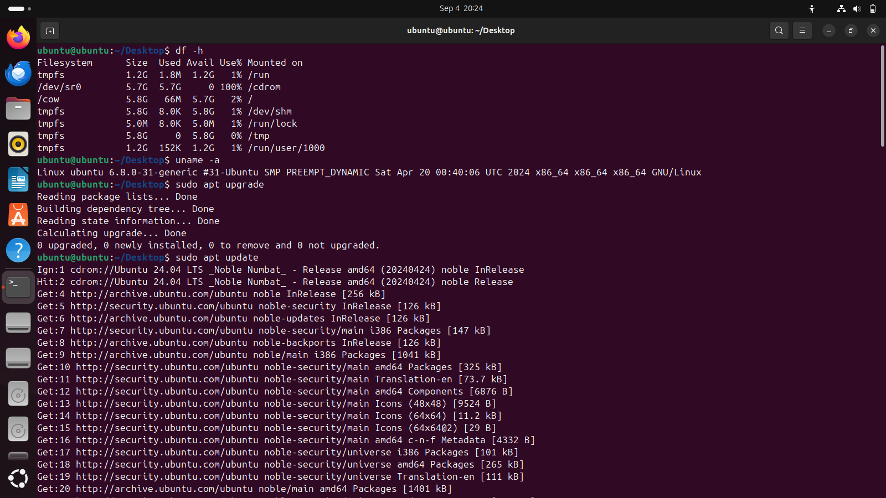


## Operasi Manipulasi Teks

- menampilkan isi file di terminal
  ```
  cat (tujuan)
  ```
- pencarian
  ```
  grep "(kata-kunci)" (tujuan)
  ```
- membuka teks editor Nano
  ```
  nano (tujuan)
  ```

> [!NOTE]
> Dalam ubuntu, `^` adalah `Shift` dan `M-` adlah `Alt`.

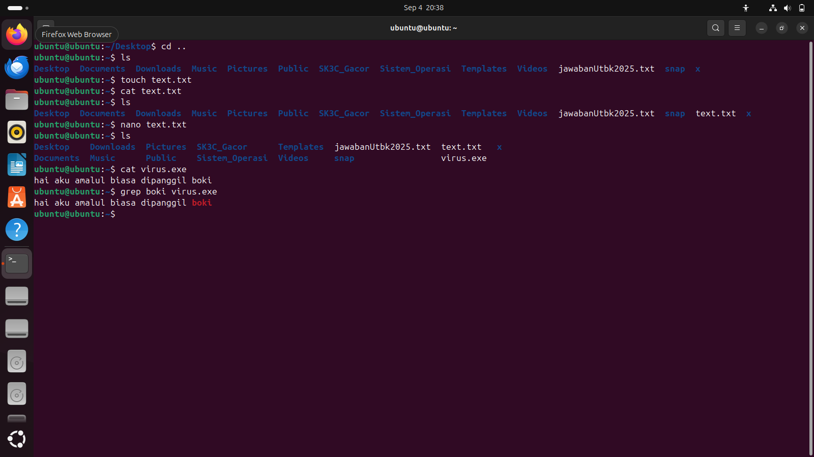
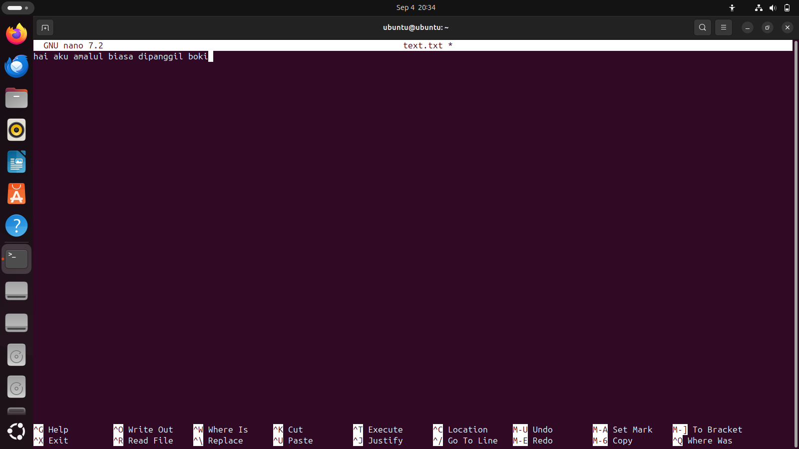

## Pengelolaan Adminstrator dan Izin

- memberikan user izin read
  ```
  chmod u+r (tujuan)
  ```
- memberikan user izin eksekusi
  ```
  chmod u+x (tujuan)
  ```
- memberikan user izin write
  ```
  chmod u+w (tujuan)
  ```
- mengubah seluruh izin file folder pada isi folder (rekursif)
  ```
  chmod -R (izin) (tujuan)
  ```

untuk menghapus izin, cukup ganti tanda `+` menjadi `-`.

jika dengan angka juga bisa dengan ketentuan:

  - `r` = 4 (read)
  - `w` = 2 (write)
  - `x` = 1 (execution)

contoh `chmod 755`:
  
  - user `rwx` = (4+2+1 = 7)
  - grup `rx` = (4+1 = 5)
  - other `rx` = (4+1 = 5)

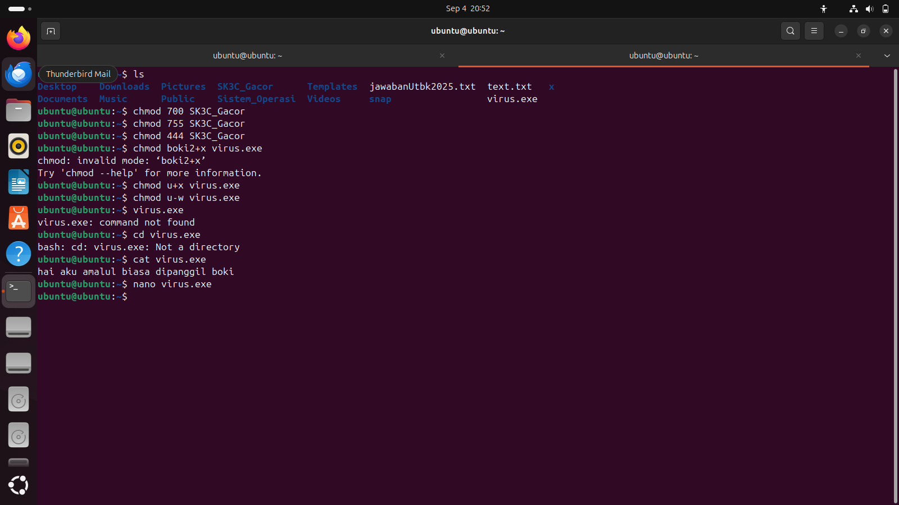
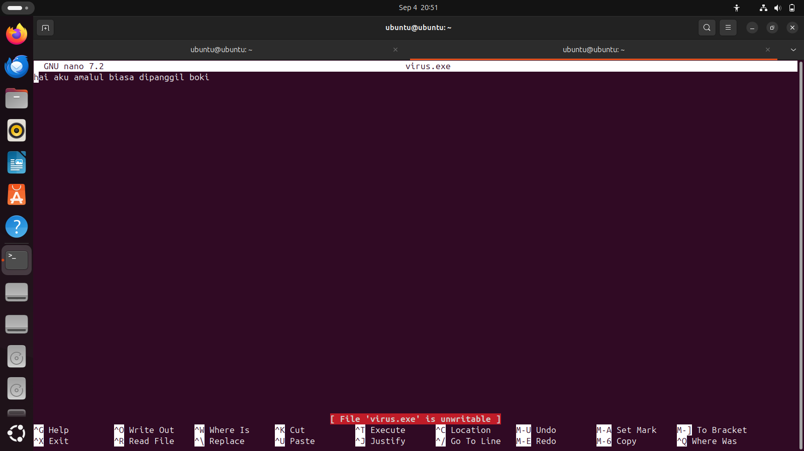


## Jaringan

- tes koneksi (ping)
  ```
  ping (alamat)
  ```
- informasi jaringan
  ```
  ifconfig
  ```
- menghubungkan ke ssh
  ```
  ssh (user)@(host)
  ```

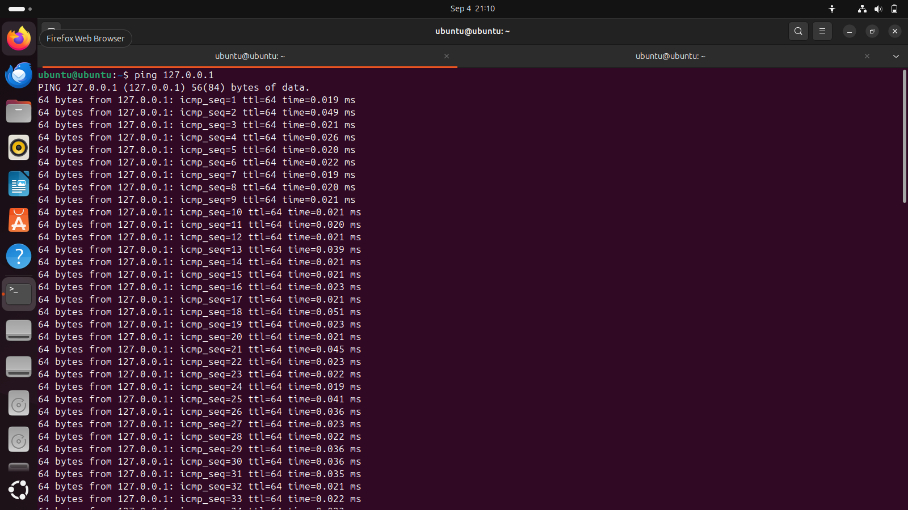
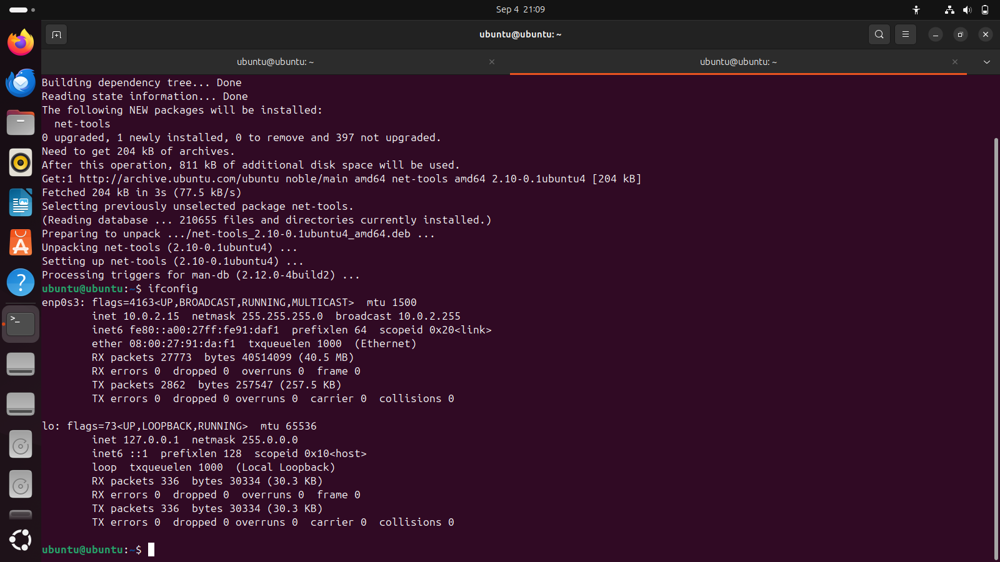

## Menginstall Beberapa Tools

sebenernya lebih cocok di kali-linux, but why not?

1. **Metasploit**  
   Metasploit adalah salah satu framework paling populer untuk eksploitasi.
   ```
   sudo apt update
   sudo apt install curl
   curl https://raw.githubusercontent.com/rapid7/metasploit-framework/master/msfinstall > msfinstall
   chmod 755 msfinstall
   sudo ./msfinstall
   ```

   

2. **Nmap**  
   Nmap digunakan untuk network discovery.
   ```
   sudo apt update
   sudo apt install nmap
   ```

    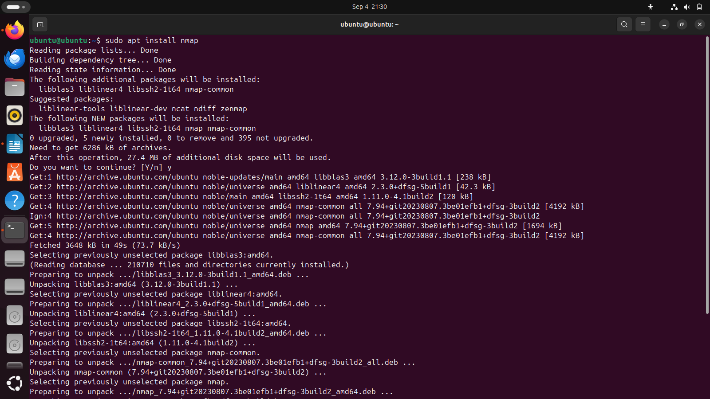

3. **Wireshark**
   Wireshark adalah alat untuk capture jaringan.
   ```
   sudo apt update
   sudo apt install wireshark
   sudo dpkg-reconfigure wireshark-common
   sudo usermod -aG wireshark $(whoami)
   ```

    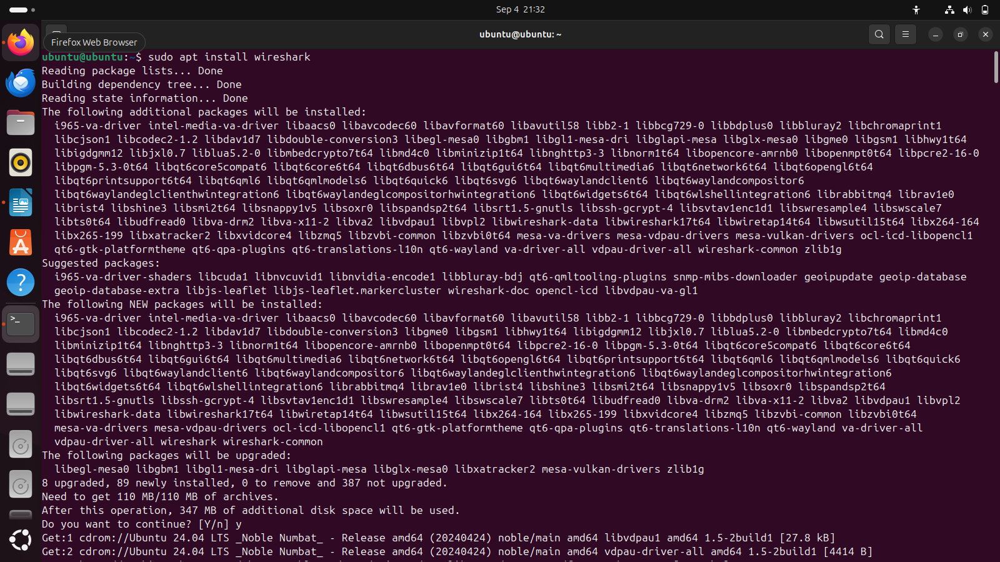

4. **John the Ripper**
   John the Ripper digunakan untuk cracking password.
   ```
   sudo apt update
   sudo apt install john
   ```

    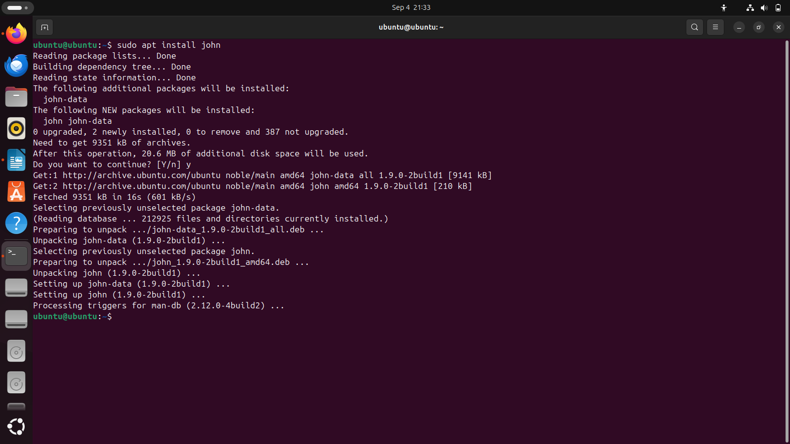

5. **Aircrack-ng**
   Aircrack-ng adalah alat untuk hacking jaringan wireless.
   ```
   sudo apt update
   sudo apt install aircrack-ng
   ```

    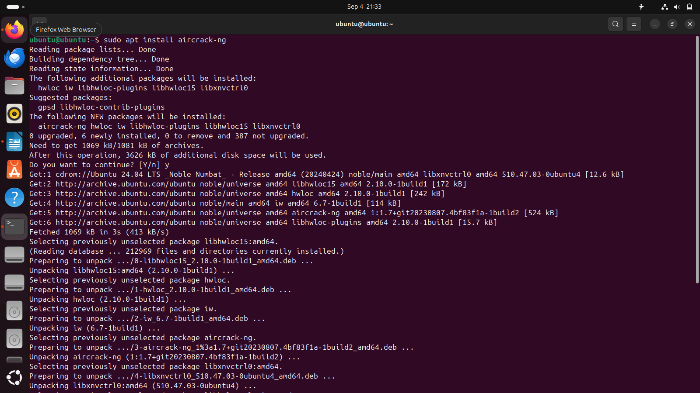

6. **Burp Suite**
   Burp Suite adalah platform yang digunakan untuk pengujian keamanan aplikasi web. (GOAT)

   download terlebih dahulu `.sh` nya [disini](https://portswigger.net/burp/releases) dan pilih linux.
   ```
   cd Download
   ls
   chmod +x (namaFileDidownload)
   sudo ./(namaFileDidownload)
   ```

    

7. **Nikto**
   Nikto adalah scanner web server.
   ```
   sudo apt update
   sudo apt install nikto
   ```

    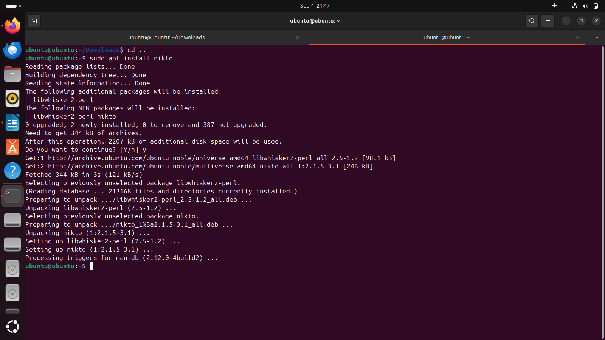

8. **sqlmap**
   Sqlmap adalah tool untuk mengotomatisasi proses deteksi dan eksploitasi SQL Injection.
   ```
   sudo apt update
   sudo apt install sqlmap
   ```

    

9.  **Hydra**
    Hydra adalah alat untuk brute-force attack.(?)
    ```
    sudo apt update
    sudo apt install hydra
    ```

    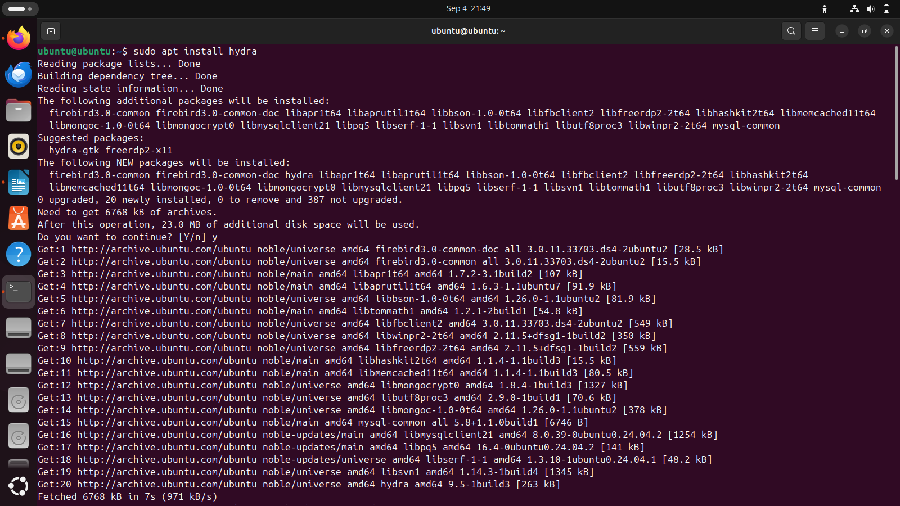

10. **OWASP ZAP**
    OWASP ZAP (Zed Attack Proxy) adalah alat ngehek.
    ```
    snap install zaproxy --classic
    ```

    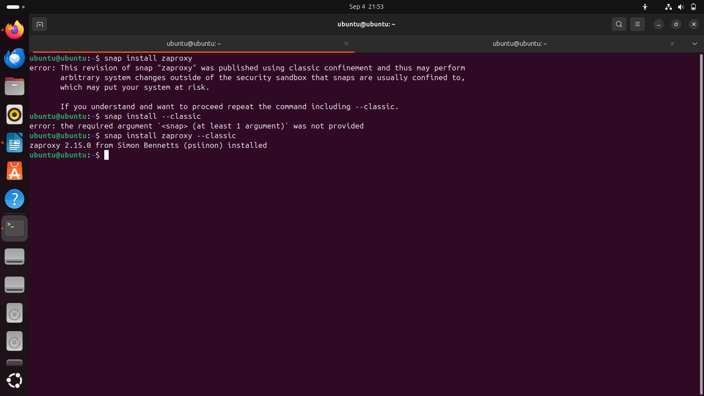

11. **Gobuster**
    Gobuster adalah alat untuk brute-forcing URI (file dan direktori) pada situs web.
    ```
    sudo apt update
    sudo apt install gobuster
    ```

    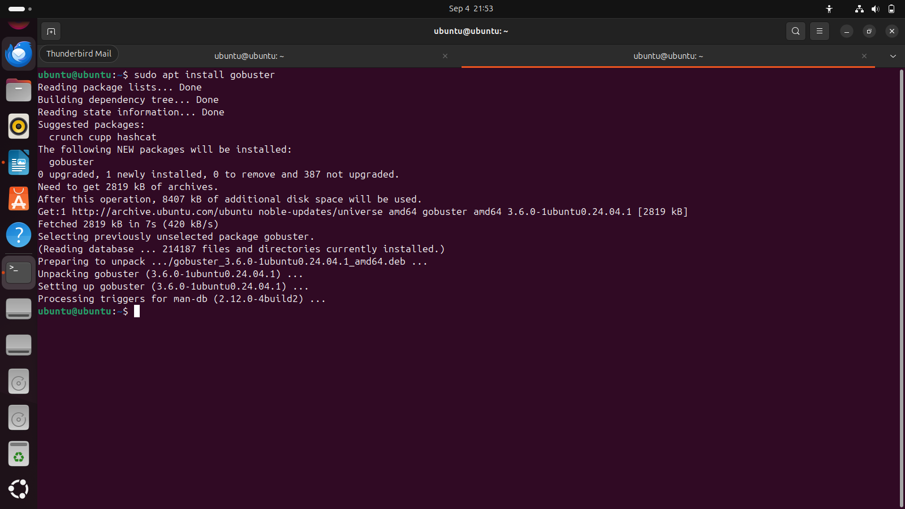

12. **Netcat**
    Netcat adalah alat untuk membaca dan menulis data melalui koneksi jaringan, digunakan untuk debugging dan ngehek.
    ```
    sudo apt update
    sudo apt install netcat-traditional
    ```
    atau
    ```
    sudo apt install netcat-openbsd
    ```

    


[^1]:Distro Linux adalah istilah yang merujuk pada distribusi sistem operasi berbasis Linux. Setiap distro terdiri dari kernel Linux yang merupakan inti dari sistem operasi, ditambah dengan koleksi perangkat lunak, manajer paket, antarmuka pengguna, dan utilitas lain yang dirancang untuk memenuhi kebutuhan tertentu atau audiens tertentu.
[^2]: **EXT4 (Fourth Extended Filesystem)** adalah versi terbaru dari keluarga sistem file EXT yang biasa digunakan di Linux. Bisa dibilang ini adalah sistem file yang paling sering dipakai di komputer Linux saat ini. EXT4 punya banyak kelebihan dibanding versi sebelumnya, seperti mendukung file yang lebih besar, bekerja lebih cepat, dan lebih stabil. 
[^3]: **EXT3 (Third Extended Filesystem)** adalah pendahulu dari EXT4 dan juga banyak digunakan di sistem Linux. Meski lebih tua, EXT3 masih stabil dan punya fitur yang cukup untuk kebutuhan sehari-hari. Salah satu fitur pentingnya adalah "journaling", yang membantu mencegah korupsi data jika komputer tiba-tiba mati.
[^4]: **SWAP** bukanlah sistem file, melainkan partisi atau file khusus yang digunakan sebagai "memori tambahan" ketika RAM komputer penuh. Ketika komputer kehabisan RAM, data akan dipindahkan ke SWAP agar komputer tidak kehabisan memori dan crash.
[^5]: **NTFS (New Technology File System)** adalah sistem file yang dikembangkan oleh Microsoft dan banyak digunakan di Windows. NTFS mendukung ukuran file yang sangat besar, memiliki fitur keamanan yang baik, dan bisa memperbaiki kesalahan file secara otomatis.
[^6]: **FAT32 (File Allocation Table 32)** adalah sistem file yang lebih tua dan sederhana dibanding NTFS. Biasanya digunakan di perangkat seperti USB flash drive dan kartu memori. Kekurangannya, FAT32 tidak bisa menyimpan file yang lebih besar dari 4 GB.
[^7]: **BTRFS (B-Tree File System)** adalah sistem file baru yang dirancang untuk memberikan fitur-fitur canggih seperti snapshot, mirroring, dan kompresi data. Ini dirancang untuk keandalan dan fleksibilitas, cocok untuk server atau pengguna yang butuh sistem file canggih.